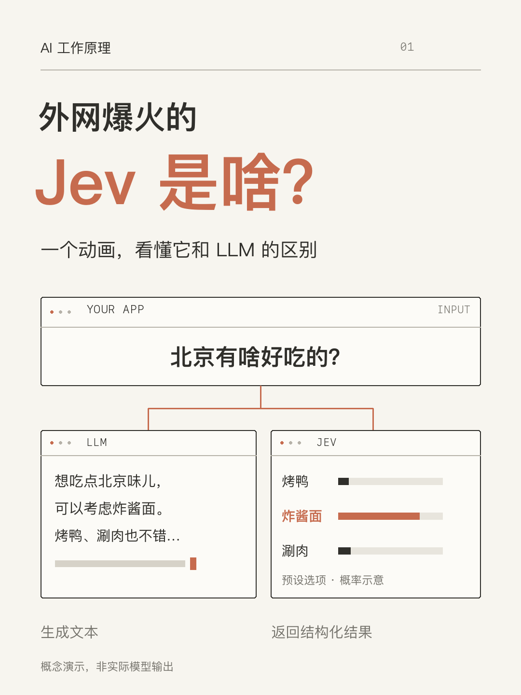

**中文** | [English](README.en.md)

# AI 轻科普（ai-light-explainer）

一个 AI Agent Skill：沿用固定的系列视觉风格，把 AI 概念做成中文轻技术科普图文、动画视频和发布文案。面向对 AI 感兴趣、不一定懂代码的读者 —— 用生活例子把机制讲准，不夸大、不编造。

## 风格

暖白底、深灰字、陶土橙强调、细线窗口。图文 3:4，视频 9:16，无配音、轻音效。




*参考封面与视频：第一期「Jev 是啥」，概念动画，非实际模型输出。*

## 目录结构

```text
ai-light-explainer/
├── SKILL.md                      # 技能入口：内容原则、制作流程、验证标准
├── references/
│   ├── visual-system.md          # 视觉规范：配色、字号、动态语法
│   └── production.md             # 制作、迁移与交付流程
├── assets/
│   ├── reference-cover.png       # 参考封面
│   ├── reference-video.mp4       # 参考视频（47 秒）
│   └── reference-project/        # 可编辑渲染工程（Python，本地生成）
└── agents/openai.yaml            # 可选客户端元数据
```

## 安装

```bash
npx skills@latest add voidning/skills --skill ai-light-explainer
```

也可以把整个 `ai-light-explainer/` 目录放进支持 Skills 的工具的技能目录。不要求特定模型或客户端。

## 使用

安装后对 Agent 说：

```text
沿用这个 skill，下期讲 Agent 的结构，图文和视频都要。
```

技能会复用已确认的主题、受众和风格，只问会改变方向的缺失信息。

## 复用工程

`assets/reference-project/render.py` 可重现参考视频的样式、打字、概率条和音效（依赖见 `requirements.txt`，纯本地渲染，无 API 调用）。它是已完成示例，不是通用生成引擎 —— 复制到工作目录后按选题重写。

## 许可

见仓库根 [LICENSE](../LICENSE)。
